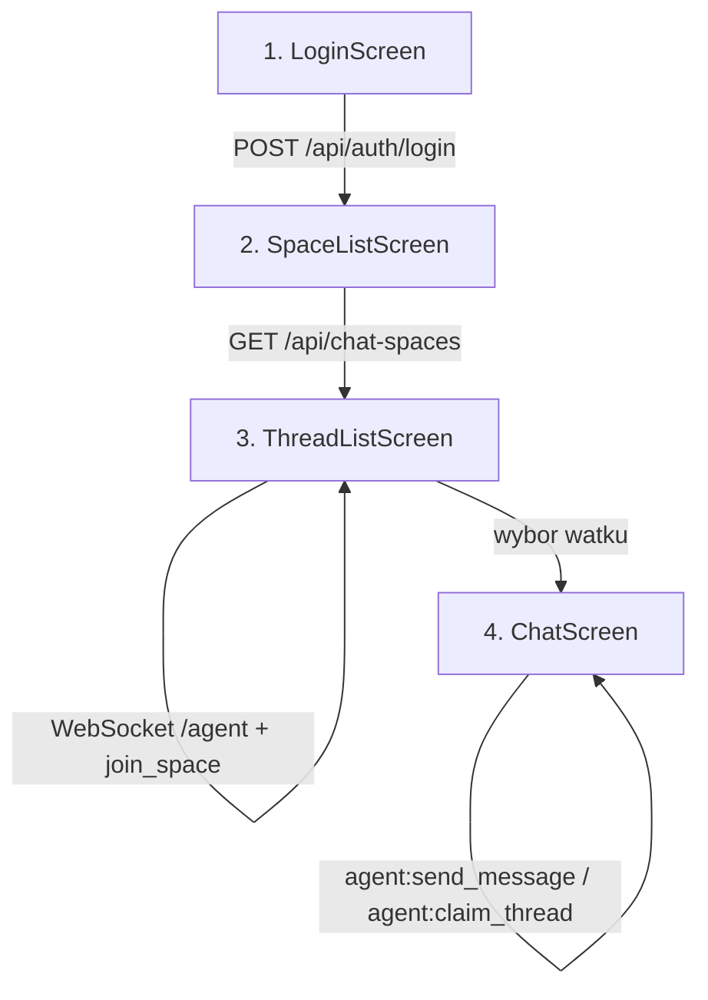

# Agent Chat Flow - Rozbudowa Aplikacji Mobilnej

## Architektura flow agenta




## Nowe ekrany

### Ekran 2: SpaceListScreen (wybor ChatSpace)

- Po zalogowaniu agent wywoluje `GET /api/chat-spaces` (JWT w headerze)
- Wyswietla liste ChatSpace'ow (nazwa)
- Po kliknieciu -> przechodzi do ThreadListScreen z `chatSpaceId`

### Ekran 3: ThreadListScreen (lista watkow)

- Laczy sie przez **WebSocket** do namespace `/agent` z JWT
- Emituje `agent:join_space { chatSpaceId }` zeby dolaczac do pokoju
- Pobiera watki REST: `GET /api/chat-spaces/:id/threads`
- Nasluchuje zdarzen WebSocket:
  - `thread:new` -- nowy watek pojawia sie na liscie
  - `thread:updated` -- zmiana statusu/przypisania watku
  - `visitor:message` -- aktualizacja "ostatnia wiadomosc" na liscie
- Emituje `agent:heartbeat` co ~30s zeby backend wiedzial ze agent jest online
- Watki pogrupowane: **Unassigned** (do przejecia) i **Active** (przypisane do agenta)

### Ekran 4: ChatScreen (rozmowa)

- Pobiera historyczne wiadomosci: `GET /api/threads/:threadId/messages`
- Nasluchuje `visitor:message` przez WebSocket (wiadomosci na zywo)
- Wysyla wiadomosci: emituje `agent:send_message { threadId, content }` przez WebSocket
- Jesli watek jest `unassigned` -- przycisk "Claim" emituje `agent:claim_thread { threadId }`

## WebSocket -- Socket.IO w KMP

Uzyje biblioteki **Ktor WebSocket** albo **krossbow** dla Socket.IO w KMP. Jednak Socket.IO to specyficzny protokol (nie czysty WebSocket), wiec najlepsze podejscie to:

- `**io.socket:socket.io-client**` (Java) -- dziala na Android
- Na iOS: expect/actual z natywnym Socket.IO lub wrapper przez Ktor

Alternatywa (prostsza na start): uzyc **tylko REST z polling** (co 3-5s odswiezanie listy watkow), a WebSocket dodac w nastepnym kroku. To pozwoli szybko miec dzialajacy flow.

## Nawigacja (rozszerzenie obecnego [App.kt](mobile/composeApp/src/commonMain/kotlin/com/mychat/app/App.kt))

```
login -> spaces -> threads/{chatSpaceId} -> chat/{threadId}
```

## Nowe pliki do utworzenia

```
commonMain/kotlin/com/mychat/app/
  data/
    model/ChatSpace.kt          -- @Serializable data class
    model/Thread.kt              -- @Serializable data class
    model/Message.kt             -- @Serializable data class
  ui/
    spaces/SpaceListScreen.kt    -- ekran wyboru ChatSpace
    spaces/SpaceListViewModel.kt
    threads/ThreadListScreen.kt  -- lista watkow
    threads/ThreadListViewModel.kt
    chat/ChatScreen.kt           -- ekran rozmowy
    chat/ChatViewModel.kt
```

Istniejacy [ApiClient.kt](mobile/composeApp/src/commonMain/kotlin/com/mychat/app/data/network/ApiClient.kt) zostanie rozszerzony o nowe metody REST (`getChatSpaces`, `getThreads`, `getMessages`, `claimThread`).

## Kluczowe decyzje

- **Faza 1 (ten plan):** REST polling co 5s dla listy watkow i nowych wiadomosci -- dziala od razu na obu platformach bez dodatkowych bibliotek
- **Faza 2 (nastepny krok):** Zamiana pollingu na Socket.IO WebSocket dla real-time -- wymaga dodania biblioteki Socket.IO

