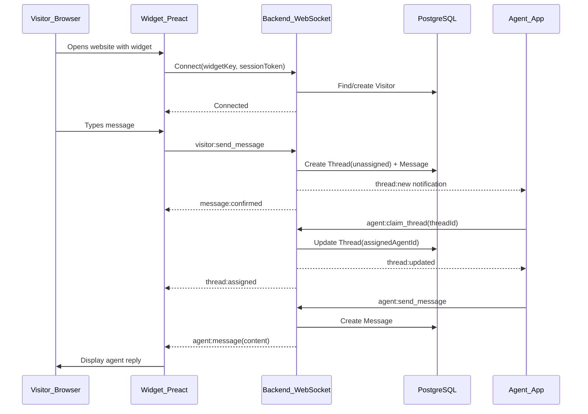

# My-Chat: Professional Chat Widget Service

## Current State

- `frontend/` -- Angular 21 + PrimeNG + Tailwind + SSR (existing, untouched for now)
- No backend, no database, no widget, no monorepo config

## Target Directory Structure

```
my-chat/
├── structures.md              # Full service description
├── frontend/                  # Angular admin panel (existing, deferred)
├── backend/                   # NestJS API + WebSocket server
│   ├── prisma/
│   │   └── schema.prisma      # Database schema (PostgreSQL)
│   ├── src/
│   │   ├── main.ts
│   │   ├── app.module.ts
│   │   ├── common/            # Guards, decorators, filters, pipes, origin validator
│   │   ├── config/            # Env config, validation
│   │   ├── redis/             # Redis module, service, presence tracker
│   │   ├── modules/
│   │   │   ├── auth/          # JWT auth for agents/orgs
│   │   │   ├── organization/  # Organization CRUD
│   │   │   ├── chat-space/    # Chat space management
│   │   │   ├── agent/         # Agent management
│   │   │   ├── thread/        # Thread lifecycle
│   │   │   ├── message/       # Message persistence
│   │   │   └── visitor/       # Visitor tracking
│   │   └── gateway/           # WebSocket gateways
│   │       ├── widget.gateway.ts    # For widget connections
│   │       └── agent.gateway.ts     # For agent connections
│   ├── package.json
│   ├── tsconfig.json
│   ├── .env.example
│   └── nest-cli.json
└── widget/                    # Preact embeddable widget
    ├── src/
    │   ├── index.tsx          # Entry point, mounts widget
    │   ├── Widget.tsx         # Root component
    │   ├── components/
    │   │   ├── ChatBubble.tsx
    │   │   ├── ChatWindow.tsx
    │   │   ├── MessageList.tsx
    │   │   └── MessageInput.tsx
    │   ├── hooks/
    │   │   └── useWebSocket.ts
    │   ├── types.ts
    │   └── styles.css         # Scoped styles (Shadow DOM or prefix)
    ├── package.json
    └── vite.config.ts         # Builds to single embeddable JS file
```

---

## 1. Database Schema (Prisma + PostgreSQL)

Core models:

- **Organization** -- company account (id, name, email, passwordHash, createdAt)
- **ChatSpace** -- one per embedded widget instance (id, organizationId, name, widgetKey [unique hash], allowedDomains [String array -- origin validation], settings JSON, createdAt)
- **Agent** -- org member who handles chats (id, organizationId, email, passwordHash, displayName, role [admin/agent], isOnline [Boolean, default false], lastSeenAt [DateTime, nullable], createdAt)
- **Visitor** -- site visitor (id, chatSpaceId, sessionToken [unique], email [nullable -- for optional pre-chat form], displayName [nullable], metadata JSON, createdAt)
- **Thread** -- conversation between visitor and agent (id, chatSpaceId, visitorId, assignedAgentId [nullable], status [unassigned/active/closed/expired], lastActivityAt [DateTime], createdAt, updatedAt)
- **Message** -- single message (id, threadId, senderType [visitor/agent/system], senderId, content, createdAt)

Key relationships:

- Organization 1--N ChatSpace
- Organization 1--N Agent
- ChatSpace 1--N Thread
- ChatSpace 1--N Visitor
- Thread N--1 Visitor
- Thread N--1 Agent (nullable)
- Thread 1--N Message

---

## 2. NestJS Backend

### REST Endpoints (for admin panel + future mobile app)

**Auth:**

- `POST /auth/register` -- create organization + first admin agent
- `POST /auth/login` -- agent login, returns JWT

**Chat Spaces:**

- `POST /chat-spaces` -- create new chat space (returns widgetKey)
- `GET /chat-spaces` -- list org's chat spaces
- `GET /chat-spaces/:id` -- get chat space details

**Threads:**

- `GET /chat-spaces/:id/threads` -- list threads (filterable by status)
- `PATCH /threads/:id/claim` -- agent claims unassigned thread
- `PATCH /threads/:id/close` -- close thread

**Messages:**

- `GET /threads/:id/messages` -- paginated message history

### WebSocket Gateways

**Widget Gateway** (`/ws/widget`):

- `connect` -- visitor connects with widgetKey + sessionToken; server validates Origin against ChatSpace.allowedDomains
- `visitor:send_message` -- visitor sends a message (auto-creates thread if none active); rate limited
- `agent:message` -- receives agent's reply (pushed to visitor)
- `agents:status` -- receives agent online/offline status (widget shows availability)

**Agent Gateway** (`/ws/agent`):

- `connect` -- agent connects with JWT + chatSpaceId; starts presence heartbeat
- `agent:join_space` -- subscribe to thread updates in a chat space
- `agent:send_message` -- send message to a thread
- `agent:heartbeat` -- periodic ping to maintain online status (auto-offline on disconnect)
- `thread:new` -- notification of new unassigned thread
- `thread:updated` -- thread status changes (claimed, closed, expired)
- `visitor:message` -- incoming visitor message (pushed to agent)

### Key Design Decisions

- **widgetKey** is a UUID v4 generated when creating a ChatSpace -- this is the public identifier embedded in the widget script tag
- **allowedDomains** on ChatSpace -- widget WebSocket connections validate `Origin` header against this list; rejects connections from unauthorized domains
- **sessionToken** for visitors stored in localStorage -- identifies returning visitors; optional email/displayName for follow-up capability
- JWT auth for agents (access + refresh tokens)
- WebSocket uses `@nestjs/websockets` with Socket.IO adapter + **Redis adapter** for horizontal scaling
- **Redis** for: Socket.IO adapter (multi-instance), agent presence tracking (online/offline heartbeat), rate limit state
- **Rate limiting** via `@nestjs/throttler` -- 1 msg/sec per visitor, max 10 active threads per chatSpace, request throttling on REST endpoints
- **Agent presence** -- heartbeat via WebSocket ping, `isOnline`/`lastSeenAt` updated in Redis + DB; widget shows "agents offline" when nobody available
- **Thread lifecycle** -- threads auto-expire after configurable inactivity period (e.g., 24h); `lastActivityAt` updated on each message
- Messages always persisted to DB, then broadcast via WebSocket

---

## 3. Preact Widget

### Embedding

```html
<script src="https://my-chat.com/widget.js" data-widget-key="abc-123-def"></script>
```

The widget builds to a single `widget.js` file (~30-50KB) via Vite. On load:

1. Reads `data-widget-key` from the script tag
2. Creates a Shadow DOM container (isolates styles from host page)
3. Renders the Preact app inside it

### Components

- **ChatBubble** -- floating button (bottom-right), click toggles window
- **ChatWindow** -- chat container with header (title + close button), message list, input
- **MessageList** -- scrollable list of messages with sender indicators
- **MessageInput** -- text input + send button

### WebSocket Hook (`useWebSocket`)

- Connects to backend's widget gateway with widgetKey + sessionToken
- Manages connection state, reconnection logic
- Provides `sendMessage()` and incoming message stream

### Style Isolation

- All styles scoped inside Shadow DOM so they never leak to/from host page
- Minimal CSS, no external dependencies

---

## 4. structures.md

A detailed document in the project root describing:

- Service overview and business model
- User roles (Organization Admin, Agent, Visitor)
- Core concepts (ChatSpace, Thread, Agent assignment)
- Data model overview
- API contract summary
- Widget embedding instructions
- Future roadmap (mobile app, Angular admin panel)

---

## Data Flow Diagram




---

## Technology Choices

- **Backend**: NestJS + Prisma + PostgreSQL + Redis + Socket.IO
- **Widget**: Preact + Vite (single bundle) + Shadow DOM
- **Auth**: JWT (access/refresh) via `@nestjs/jwt` + `passport-jwt`
- **Validation**: `class-validator` + `class-transformer` in NestJS
- **Rate Limiting**: `@nestjs/throttler` (REST) + custom WebSocket throttle
- **Config**: `@nestjs/config` with `.env` files
- **Redis**: `ioredis` + `@socket.io/redis-adapter` for WS scaling + presence

