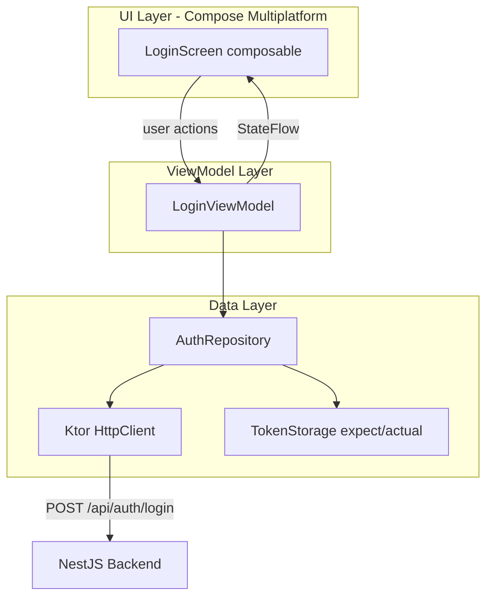

# KMP Mobile Login App for My-Chat

## Context

The existing backend ([backend/](backend/)) is a NestJS app with JWT authentication. The login endpoint:

- **POST** `/api/auth/login`
- **Request body:** `{ email: string, password: string }`
- **Response:** `{ accessToken: string, refreshToken: string, expiresIn: number }`

Tokens are Bearer JWTs. The access token expires in 15 minutes, the refresh token in 7 days. There is also a `POST /api/auth/refresh` endpoint for token renewal.

---

## Step 1: Generate the KMP project

Use the **KMP Web Wizard** at [kmp.jetbrains.com](https://kmp.jetbrains.com) to generate the project skeleton:

- **Project name:** `my-chat-mobile`
- **Targets:** Android + iOS (with "Share UI" enabled for Compose Multiplatform)
- **No desktop/web** -- only mobile targets

This produces the standard KMP layout:

```
my-chat-mobile/
  composeApp/
    src/
      commonMain/    -- shared Kotlin + Compose UI
      androidMain/   -- Android-specific code
      iosMain/       -- iOS-specific code
  iosApp/            -- Xcode project wrapping the iOS framework
  gradle/
  build.gradle.kts
  settings.gradle.kts
```

Place the generated project inside the repository root as `mobile/`.

---

## Step 2: Add dependencies

In `composeApp/build.gradle.kts`, add these to `commonMain.dependencies`:


| Library                                                                                                            | Purpose                          |
| ------------------------------------------------------------------------------------------------------------------ | -------------------------------- |
| **Ktor Client** (`ktor-client-core`, `ktor-client-content-negotiation`, `ktor-client-auth`, `ktor-client-logging`) | HTTP client with Bearer auth     |
| **Ktor Serialization** (`ktor-serialization-kotlinx-json`)                                                         | JSON serialization               |
| **kotlinx-serialization**                                                                                          | Shared data models               |
| **Koin** (`koin-core`, `koin-compose`)                                                                             | Dependency injection             |
| **Navigation Compose** (`navigation-compose`)                                                                      | Screen navigation                |
| **Lifecycle ViewModel** (`lifecycle-viewmodel-compose`)                                                            | ViewModel support in shared code |


Platform-specific engines:

- `androidMain`: `ktor-client-okhttp`
- `iosMain`: `ktor-client-darwin`

---

## Step 3: Project architecture (MVVM)




---

## Step 4: Implement the shared data layer

### 4a. Data models (`commonMain/kotlin/data/model/`)

```kotlin
@Serializable
data class LoginRequest(val email: String, val password: String)

@Serializable
data class AuthTokens(
    val accessToken: String,
    val refreshToken: String,
    val expiresIn: Int
)
```

### 4b. Ktor HttpClient factory (`commonMain/kotlin/data/network/HttpClientFactory.kt`)

Create a shared `HttpClient` configured with:

- `ContentNegotiation` with `json()` (lenient, ignore unknown keys)
- `Auth` with `bearer {}` provider:
  - `loadTokens` -- reads from `TokenStorage`
  - `refreshTokens` -- calls `POST /api/auth/refresh` with `oldTokens?.refreshToken`
  - `sendWithoutRequest { true }` -- always sends token on requests
- `Logging` for debug builds
- `defaultRequest { url("http://10.0.2.2:3300/api/") }` (Android emulator) -- make the base URL configurable via `expect/actual`

### 4c. Token storage (`expect/actual`)

Declare `expect` in `commonMain`:

```kotlin
expect class TokenStorage {
    suspend fun saveTokens(tokens: AuthTokens)
    suspend fun loadTokens(): AuthTokens?
    suspend fun clearTokens()
}
```

- **androidMain**: implement with `SharedPreferences` (or `EncryptedSharedPreferences` for production)
- **iosMain**: implement with `NSUserDefaults` (or Keychain for production)

For this first step, simple platform storage is sufficient. Secure storage can be added later.

### 4d. AuthRepository (`commonMain/kotlin/data/repository/AuthRepository.kt`)

```kotlin
class AuthRepository(
    private val httpClient: HttpClient,
    private val tokenStorage: TokenStorage
) {
    suspend fun login(email: String, password: String): Result<AuthTokens> {
        return try {
            val response: AuthTokens = httpClient.post("auth/login") {
                contentType(ContentType.Application.Json)
                setBody(LoginRequest(email, password))
            }.body()
            tokenStorage.saveTokens(response)
            Result.success(response)
        } catch (e: Exception) {
            Result.failure(e)
        }
    }
}
```

---

## Step 5: Implement the ViewModel

`commonMain/kotlin/ui/login/LoginViewModel.kt`:

```kotlin
class LoginViewModel(private val authRepository: AuthRepository) : ViewModel() {
    private val _uiState = MutableStateFlow(LoginUiState())
    val uiState: StateFlow<LoginUiState> = _uiState.asStateFlow()

    fun onEmailChange(email: String) { _uiState.update { it.copy(email = email) } }
    fun onPasswordChange(password: String) { _uiState.update { it.copy(password = password) } }

    fun login() {
        viewModelScope.launch {
            _uiState.update { it.copy(isLoading = true, error = null) }
            authRepository.login(_uiState.value.email, _uiState.value.password)
                .onSuccess { _uiState.update { it.copy(isLoading = false, isLoggedIn = true) } }
                .onFailure { e -> _uiState.update { it.copy(isLoading = false, error = e.message) } }
        }
    }
}

data class LoginUiState(
    val email: String = "",
    val password: String = "",
    val isLoading: Boolean = false,
    val isLoggedIn: Boolean = false,
    val error: String? = null
)
```

---

## Step 6: Implement the Login UI

`commonMain/kotlin/ui/login/LoginScreen.kt` -- a Compose Multiplatform screen with:

- Material 3 design (`MaterialTheme`)
- Email `OutlinedTextField` (keyboard type = Email)
- Password `OutlinedTextField` (visual transformation = password dots, keyboard type = Password)
- "Login" `Button` (disabled while loading)
- `CircularProgressIndicator` during loading
- Error message displayed via `Text` in red / `Snackbar`
- Success state shows a simple "Logged in successfully" message (placeholder for future navigation)

---

## Step 7: Wire up with Koin DI

`commonMain/kotlin/di/AppModule.kt`:

```kotlin
val appModule = module {
    single { HttpClientFactory.create(get()) }
    single { AuthRepository(get(), get()) }
    viewModel { LoginViewModel(get()) }
}
```

Platform modules provide `TokenStorage`:

- `androidMain/kotlin/di/PlatformModule.kt` -- provides Android `TokenStorage`
- `iosMain/kotlin/di/PlatformModule.kt` -- provides iOS `TokenStorage`

---

## Step 8: Navigation setup

Use `navigation-compose` (2.9.x) for the multiplatform nav graph:

```kotlin
@Serializable data object LoginRoute
@Serializable data object HomeRoute  // placeholder for future

NavHost(navController, startDestination = LoginRoute) {
    composable<LoginRoute> { LoginScreen(onLoginSuccess = { navController.navigate(HomeRoute) }) }
    composable<HomeRoute> { HomeScreen() }  // simple "Welcome, you are logged in" placeholder
}
```

---

## Step 9: Platform entry points

- **Android**: `MainActivity` with `setContent { App() }` -- standard Compose entry point
- **iOS**: `MainViewController` using `ComposeUIViewController { App() }` in `iosMain`

---

## Summary of files to create

```
mobile/
  composeApp/
    build.gradle.kts                          -- dependencies & targets
    src/
      commonMain/kotlin/
        data/model/LoginRequest.kt
        data/model/AuthTokens.kt
        data/network/HttpClientFactory.kt
        data/repository/AuthRepository.kt
        data/storage/TokenStorage.kt          -- expect declaration
        di/AppModule.kt
        ui/login/LoginViewModel.kt
        ui/login/LoginUiState.kt
        ui/login/LoginScreen.kt
        ui/home/HomeScreen.kt                 -- placeholder
        navigation/AppNavigation.kt
        App.kt                                -- root composable
      androidMain/kotlin/
        data/storage/TokenStorage.android.kt  -- actual impl
        di/PlatformModule.android.kt
        MainActivity.kt
      iosMain/kotlin/
        data/storage/TokenStorage.ios.kt      -- actual impl
        di/PlatformModule.ios.kt
        MainViewController.kt
  iosApp/                                      -- generated Xcode project
  build.gradle.kts
  settings.gradle.kts
  gradle.properties
```

## Key decisions

- **Compose Multiplatform** for shared UI (not platform-specific XML/SwiftUI) -- maximizes code sharing
- **Ktor 3.x** as HTTP client -- official multiplatform HTTP library from JetBrains
- **Koin** for DI -- lightweight, KMP-native, no annotation processing
- **MVVM** with `ViewModel` + `StateFlow` -- official recommended pattern
- **Navigation Compose** (2.9.x) -- official multiplatform navigation library
- **kotlinx.serialization** -- official multiplatform JSON serialization
- Base URL will be configurable via `expect/actual` (`10.0.2.2:3300` for Android emulator, `localhost:3300` for iOS simulator)

